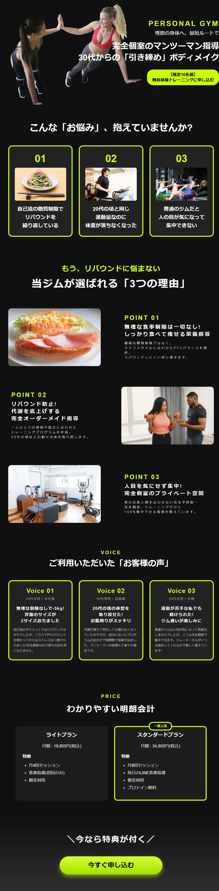
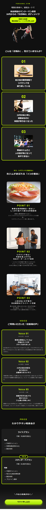

# パーソナルジム LP（ランディングページ）

パーソナルジムの新規顧客獲得（無料体験・カウンセリング誘導）を目的としたランディングページです。デザインカンプの作成からHTML/CSS実装、レスポンシブ対応まで一貫して制作しました。

  
  

---

## 概要
- **担当範囲:** デザイン（GIMP）、コーディング（HTML5 / CSS3 / レスポンシブ対応）
- **公開URL:** https://norihumi.github.io/personal-gym-lp/
- **制作期間:** 7日

---

## デザイン仕様

### [コンセプト]
- **洗練されたスタイリッシュ感と信頼感**
  - ボディメイクに対するモチベーションを高めるスポーティーで清潔感のあるデザイン。
  - ターゲット層（トレーニング初心者〜経験者）が直感的に「通いたい」と思える力強さと安心感を両立させています。

### [カラーパレット]
- **ベースカラー:** ホワイト / ダークグレー（清潔感と引き締め効果）
- **メインカラー:** エネルギッシュなカラー（ブラック・ネイビー・ビビッドカラー等）
- **アクセントカラー:** オレンジまたはレッド（CVボタン・強調テキストなどの視線誘導）

### [フォント]
- **ゴシック体（Sans-serif）**
  - モダンで力強い印象を与えるゴシック体をベースに採用。
  - キャッチコピーや数字（実績・料金など）を太字（`font-weight`）で際立たせ、力強い視覚的インパクトを算出。

---

## コーディング仕様

### [レスポンシブ対応]
- **ブレイクポイント: 768px（スマホ表示最適化）**
  - トレーナー紹介、料金表、選ばれる理由などの複数カラム要素を、スマホ表示時に `flex-direction: column` で1列に再配置。
  - 画面サイズに応じて余白やフォントサイズを微調整し、ストレスのない縦スクロール閲覧を実現。

### [CTAボタン]
- **コンバージョン（体験予約）に繋げる視認性設計**
  - ユーザーがどの位置からでもアクションを起こしやすいよう、色相環の対比を利用した目立つ配色と十分なタップ領域（90%幅等）を確保。
  - ホバー時のインタラクションで押しやすさを強調。

### [セマンティックHTML]
- **構造化と実用的なリンク設計**
  - `<header>`, `<main>`, `<section>`, `<footer>` などの適切なHTML5要素を用いて文書構造を最適化。
  - 電話問い合わせリンク（`href="tel:..."`）や予約フォームへのスムーズな導線を確保。
